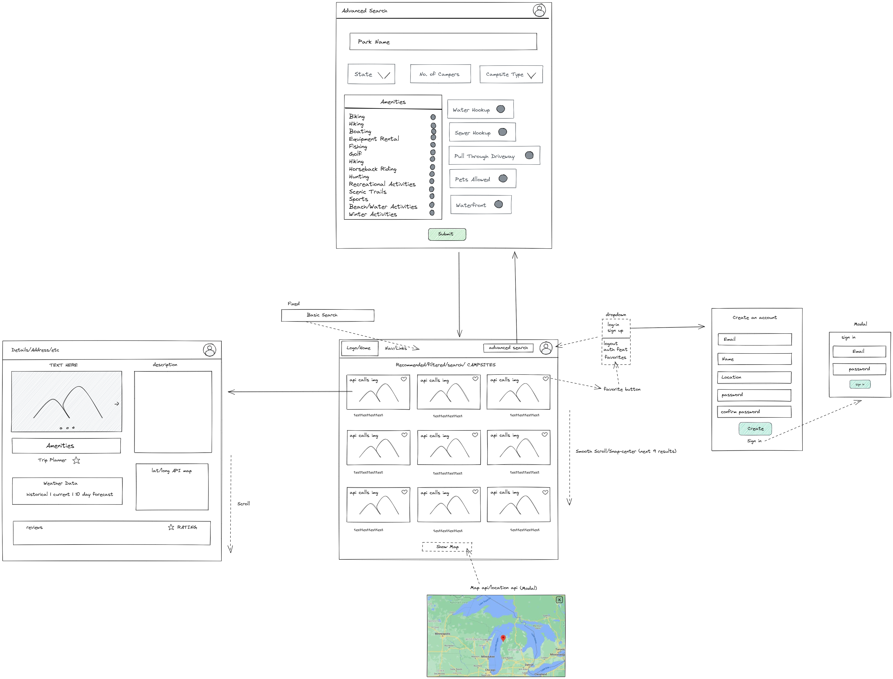

[Campsight]
[Team Members]
Cooper Broderick
Edward O'Brien
Jeff Jiang
Tyler Joyce

# What is Campsight and Why did we make it

CampSight is a camping application that uses a combination of technologies to provide a seamless user experience. The backend of the application is powered by Python and the FastAPI web framework. The application also uses mongoDB for its database, which is a NoSQL database. Our parks-api also makes use of the NPS (National Park Service) Data API to allow users to find the parks they are looking for. The application also use Galvanize's JWTDown for FastAPI module for user authentication.

On the front-end, the application is built using JavaScript and the React framework. This allows for a responsive and interactive user interface that makes it easy for users to search and find national parks. The application also integrates with the Google Maps API, which allows users to view maps of the local area around the parks as well as see where parks fall over the United States and its territories.

In addition to the search and map features, the application also allows users to favorite and rate the camps they have visited. This allows other users to easily see which camps are the most popular and make informed decisions about visting certain parks. Overall, CampSight is a powerful and user-friendly camping application that makes it easy for users to find and explore national parks.

## Intended Market

Customers who are interested in camping, hiking and enjoying national parks would benefit most from CampSight. The review and favorite features would allow customers to read reviews from other enthusiasts and see what their favorite features of the parks are, which would help them make an informed decision about where to visit. The searchable database would make it easier for customers to find the perfect destination that meets their needs and preferences. People who would benefit from using CampSight would include families, hikers, campers, and travel enthusiasts.

## Our approach

Our intial approach to the website was based on our wireframe design. We built the layout of the front-end portion of our application in react first, using the wireframe for a guide. We then went into fastAPI and created endpoints to filter and provide data about different parks, allow users to login and recieve an authentication token, and allow authenticated users to leave reviews and favorite parks.

## M.V.P.

We layed out login/logout/signup, the park details pages, the main page with the list of parks, and the advanced search page as our base features. We also had the integration of the Google Maps API, favoriting parks, and leaving reviews as features for our MVP.

## Stretch Goals

We are laying out a quick search function for the search bar on the main page, the profile page for users, tying accounts to reviews rather than reviews being anonymous, advanced search as a drop down on the main page where the calendar search is now, allowing users to mark parks as visited, implementing dynamic weather data to the details page, and allowing for selecting multiple options on the advanced search page.

## Setup
1. Fork and Clone repo [https://gitlab.com/hack-reactor2/project-gamma]
2. CD into ghi directory.
3. Create a .env file
4. Set REACT_APP_MAPS_API to your Google Maps API key
5. Set REACT_APP_PARKS_API_HOST to "http://localhost:8000"
6. Set REACT_APP_ACCOUNTS_API_HOST to "http://localhost:8001"
4. run -npm install
5. CD out of the ghi directory
6. CD into parks_api directory
7. Create a keys.py file and set CAMP_API to your NPS Data API key
8. CD out of the parks_api directory
9. run -docker compose build
10. run -docker compose up

## Test
Cooper - Test Reviews (accounts_api\tests\test_reviews.py)
Jeff - Test Accounts (accounts_api\tests\test_account.py) & Test Token (accounts_api\tests\test_get_token.py) & Test Create Profile (accounts_api\tests\test_create_profile.py)
Ted - Test Favorites (accounts_api\tests\test_favorite.py)
Tyler - Test Profiles (accounts_api\tests\test_profiles.py)

## Deliverables

- [API documentation] (docs\api-design.md)
- [Project is deployed to Render.com/GitLab-pages]  (https://hack-reactor2.gitlab.io/project-gamma/)
- [GitLab issue board is setup and in use] (https://gitlab.com/hack-reactor2/project-gamma/-/issues)
- [Cooper Journal] (journals\cooper_broderick.md)
- [Ted Journal] (journals\edward_obrien.md)
- [Jeff Journal] (journals\jeff.md)
- [Tyler Journal] (journals\Tyler_Joyce.md)

### Directories / layout

+---accounts_api\
|   |   Dockerfile\
|   |   Dockerfile.dev\
|   |   main.py\
|   |   models.py\
|   |   requirements.txt\
|   |   token_auth.py\
|   |
|   +---.pytest_cache\
|   |   |   .gitignore\
|   |   |   CACHEDIR.TAG\
|   |   |   README.md\
|   |   |
|   |   \---v\
|   |       \---cache\
|   |               lastfailed\
|   |               nodeids\
|   |               stepwise\
|   |
|   +---migrations\
|   |       __init__.py\
|   |
|   +---queries\
|   |   |   accounts.py\
|   |   |   client.py\
|   |   |   event.py\
|   |   |   favorites.py\
|   |   |   profiles.py\
|   |   |   review.py\
|   |   |   sessions.py\
|   |   |   __init__.py\
|   |   |
|   |   \---__pycache__\
|   |           accounts.cpython-310.pyc\
|   |           client.cpython-310.pyc\
|   |           event.cpython-310.pyc\
|   |           favorites.cpython-310.pyc\
|   |           profiles.cpython-310.pyc\
|   |           review.cpython-310.pyc\
|   |           sessions.cpython-310.pyc\
|   |           __init__.cpython-310.pyc\
|   |
|   +---routers\
|   |   |   accounts.py\
|   |   |   auth.py\
|   |   |   event.py\
|   |   |   favorites.py\
|   |   |   profiles.py\
|   |   |   review.py\
|   |   |   sockets.py\
|   |   |   __init__.py\
|   |   |
|   |   \---__pycache__\
|   |           accounts.cpython-310.pyc\
|   |           auth.cpython-310.pyc\
|   |           event.cpython-310.pyc\
|   |           favorites.cpython-310.pyc\
|   |           profiles.cpython-310.pyc\
|   |           review.cpython-310.pyc\
|   |           sockets.cpython-310.pyc\
|   |           __init__.cpython-310.pyc\
|   |
|   +---tests\
|   |   |   test_account.py\
|   |   |   test_favorite.py\
|   |   |   test_get_token.py\
|   |   |   test_profiles.py\
|   |   |   test_reviews.py\
|   |   |   __init__.py\
|   |   |
|   |   \---__pycache__\
|   |           test_account.cpython-310-pytest-7.2.0.pyc\
|   |           test_favorite.cpython-310-pytest-7.2.0.pyc\
|   |           test_get_token.cpython-310-pytest-7.2.0.pyc\
|   |           test_profiles.cpython-310-pytest-7.2.0.pyc\
|   |           test_reviews.cpython-310-pytest-7.2.0.pyc\
|   |           __init__.cpython-310.pyc\
|   |
|   \---__pycache__\
|           main.cpython-310.pyc\
|           models.cpython-310.pyc\
|
+---api\
|   +---queries\
|   |   \---__pycache__\
|   |           accounts.cpython-310.pyc\
|   |           client.cpython-310.pyc\
|   |           profiles.cpython-310.pyc\
|   |           __init__.cpython-310.pyc\
|   |
|   +---routers\
|   |   \---__pycache__\
|   |           accounts.cpython-310.pyc\
|   |           auth.cpython-310.pyc\
|   |           profiles.cpython-310.pyc\
|   |           __init__.cpython-310.pyc\
|   |
|   \---__pycache__\
|           main.cpython-310.pyc\
|           models.cpython-310.pyc\
|
+---docs\
|       api-design.md\
|
+---ghi\
|   |   .env\
|   |   .gitignore\
|   |   package-lock.json\
|   |   package.json\
|   |   windows-setup.js\
|   |   yarn.lock\
|   |
|   +---public\
|   |       favicon.ico\
|   |       index.html\
|   |       logo192.png\
|   |       logo512.png\
|   |       manifest.json\
|   |       robots.txt\
|   |
|   \---src\
|       |   index.css\
|       |   index.js\
|       |   logo.svg\
|       |   reportWebVitals.js\
|       |   yarn.lock\
|       |
|       +---app\
|       |       accountSlice.js\
|       |       api.js\
|       |       eventApi.js\
|       |       profileApi.js\
|       |       searchSlice.js\
|       |       store.js\
|       |       utils.js\
|       |
|       \---Components\
|           +---App\
|           |       App.css\
|           |       App.js\
|           |
|           +---Banner\
|           |       Banner.css\
|           |       Banner.js\
|           |       Bg1.jpg\
|           |       Bg2.jpg\
|           |       Bg3.jpg\
|           |
|           +---Card\
|           |       Card.css\
|           |       Card.js\
|           |
|           +---DetailDisplay\
|           |       DetailDisplay.css\
|           |       DetailDisplay.js\
|           |
|           +---DetailPage\
|           |       DetailPage.css\
|           |       DetailPage.js\
|           |
|           +---Event\
|           |       CreateEvent.js\
|           |       Event.css\
|           |       Event.js\
|           |       keys.js\
|           |
|           +---Footer\
|           |       Footer.css\
|           |       Footer.js\
|           |
|           +---Header\
|           |       campSight.png\
|           |       campSight.svg\
|           |       Header.css\
|           |       Header.js\
|           |
|           +---Home\
|           |       Home.css\
|           |       Home.js\
|           |\
|           +---Login\
|           |       Login.css\
|           |       Login.js\
|           |       SignUp.js\
|           |
|           +---Map\
|           |       Map.js\
|           |
|           +---Modal\
|           |       Modal.css\
|           |       Modal.js\
|           |
|           +---Profile\
|           |       EditProfile.js\
|           |       ProfilePage.js\
|           |
|           +---Review\
|           |       Review.css\
|           |       Review.js\
|           |
|           \---Search\
|                   AdvancedSearchForm.js\
|                   Search.css\
|                   Search.js\
|
+---journals\
|       cooper_broderick.md\
|       edward_obrien.md\
|       jeff.md\
|       Tyler_Joyce.md\
|
+---parks_api\
|   |   Dockerfile\
|   |   Dockerfile.dev\
|   |   keys.py\
|   |   main.py\
|   |   requirements.txt\
|   |
|   +---migrations\
|   |       001_sample_migration.py\
|   |       __init__.py\
|   |       __main__.py\
|   |
|   +---routers\
|   |   |   parks.py\
|   |   |
|   |   \---__pycache__\
|   |           parks.cpython-310.pyc\
|   |
|   \---__pycache__\
|           keys.cpython-310.pyc\
|           main.cpython-310.pyc\
|
+---sample_service\
|   +---routers\
|   |   \---__pycache__\
|   |           parks.cpython-310.pyc\
|   |
|   \---__pycache__\
|           keys.cpython-310.pyc\
|           main.cpython-310.pyc\
|
\---setup\
    +---mongo-express\
    |       Dockerfile.dev\
    |
    \---mongodb\
            01-create-unique-account-index.js\
            Dockerfile.dev\
